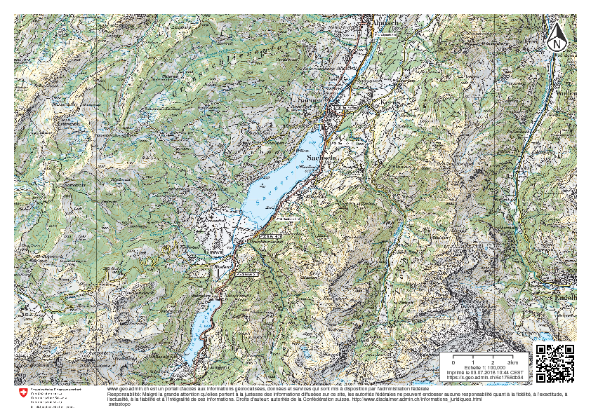

Print Service
=============


Print service for [https://map.geo.admin.ch], based on [MapFish Print v2](http://mapfish.github.io/)
It uses the standard *mapfish print protocol* of [MapFish Print v2](http://www.mapfish.org/doc/print/),
extended for multipages print.


# Architecture

## Elastic Load Balancer

* //vpc-lb-print-(dev|int|prod).intra.bgdi.ch

## Elastic File System
A r/w EFS for application, mounted in docker container on _/var/local/print_

* fs-080aa4c1.efs.eu-west-1.amazonaws.com://print/(dev|int|prod)

## Docker containers

* **nginx**, responding on port 8009, dispatching requests on various backend
* **flask** application, on port 8010, to split the *multipages* requests into
  single ones, and then merge them into a single pdf document
* **tomcat**, with a single application *service-print-main* responding on 8011
                                                                                                                                       
```                                                                                                                      
  Nginx:8009               Flask (wsgi) :8010                Tomcat 8011                  EFS  
                                                                                                  
+----------------+         +-------------+                                          +-----------+
|                |         |             |          write assembled pages           |           |
|                |         | split into  |----------------------------------------->|           |
| /printmulti    | ------> | single page |        get single pages                  |           |
| /printprogress |         |   print     |<---------------------------------------- |           |
| /printcancel   |         |             |                                          |           |
|                |         |             | prints    +-------------------+          |           |
|                |         |             |-----------|                   | -------> |           |
|                |         |             | single    |                   |          |           |
|                |         +-------------+ page      |/service-print-main|          |           |
|                |                                   |                   |          |           |
|                |                                   |                   |          |           |
|                |                                   |                   |          |           |
|                |     single page print             |                   |  writes  |           |
|  /print        |-----------------------------------|                   |--------> |           |
|                |                                   |                   |          |           |
|                |        -                          |                   |          |           |
|                |                                   |                   |          |           |
|                |                                   |                   |          |           |
|                |                                   |                   |          |           |
| /(.*).pdf      |                                   +-------------------+          |           |
|                | <--------------------------------------------------------------  |           |
+----------------+                         retrieve PDFs                            |           |
                                                                                    |           |
                                                                                    +-----------+

```                                                                                                                      
                                                         
                                                                                            
# Endpoint

## Hostnames

    print.geo.admin.ch and service-print.(dev|int|prod).bgdi.ch

## ELB
 
     http://vpc-lb-print-(dev|int|prod).intra.bgdi.ch:8009


# URI

    Apache/Nginx                            Flask/WSGI                               Tomcat
   
    GET  /print/info.json                                               GET /service-print-main/pdf/info.json
    
    POST /print/create.json                                             POST /service-print-main/pdf/create.json
    
    POST /printmulti/create.json       POST /printmulti/create.json
    
    GET  /printprogress?id=232323      GET /printprogress?id=232323
    
    GET  /printcancel                  GET /printcancel                          EFS (/var/local/print
                                                                                     
    GET /print/-multi23444545.pdf.printout                               mapfish-print-multi23444545.pdf.printout
    GET /print/9032936254995330149.pdf.printout                          mapfish-print9032936254995330149.pdf.printout

# Compiling mapfish-print.jar

Use Java 7 (won't compile with older or newer version)

    java -version
    java version "1.7.0_181"
    OpenJDK Runtime Environment (IcedTea 2.6.14) (7u181-2.6.14-1~deb8u1)
    OpenJDK 64-Bit Server VM (build 24.181-b01, mixed mode)


Use custom branch `2.1.x_geoadmin3` and disable tests (as tests geodata are long gone):

    2.1.x_geoadmin3* 130 ± ./gradlew  build -x test -x check
    :compileJava UP-TO-DATE
    :processResources UP-TO-DATE
    :classes UP-TO-DATE
    :imageMagickWar
    :jar
    :javadoc UP-TO-DATE
    :libJavadocJar UP-TO-DATE
    :libSourcesJar UP-TO-DATE
    :standalone
    :standaloneJavadocJar UP-TO-DATE
    :standaloneSourcesJar UP-TO-DATE
    :war
    :assemble
    :build
    :e2e-tests:compileJava UP-TO-DATE
    :e2e-tests:processResources UP-TO-DATE
    :e2e-tests:classes UP-TO-DATE
    :e2e-tests:jar UP-TO-DATE
    :e2e-tests:assemble UP-TO-DATE
    :e2e-tests:build
    
    BUILD SUCCESSFUL
    
    Total time: 23.3 secs


# Getting started

Checkout the source code:

    git clone https://github.com/geoadmin/print-service.git

or when you're using ssh key (see https://help.github.com/articles/generating-ssh-keys):


    make user

# Flask WSGI application

`Flask` alone development:

    make server
    
or serving with `gunicorn`

    make gunicornserver
    
# Tomcat

The war file `print-servlet-2.1.3-SNAPSHOT.war` is based on the mapfish-print 2.1.3 branch [#46d901520](https://github.com/mapfish/mapfish-print/commit/46d9015209fb2d975cee3f580bf387cd2f15b2e0)

If you update files in the `tomcat` directory, you'll have to rebuild the `.war` file
using the command:

    make printwar

This generate a new  file *service-print-main.war* using the `BASEWAR` war file.


# Docker

## Building

   make composetemplatedev dockerbuild

This build three docker images, labeled `staging`:

    swisstopo/service-print          staging               538532a4bed5        2 minutes ago       374.5 MB
    swisstopo/service-print-nginx    staging               f67aa9b5baa1        35 hours ago        152.3 MB
    swisstopo/service-print-tomcat   staging               17c35a184a46        4 days ago          424.7 MB


## Running locally

    make dockerrun

or

    docker-compose up
   
   
# Testing  


## Checker

Look for the `Server` header!

Nginx checker

    curl -I localhost:8009/checker
    HTTP/1.1 200 OK
    Server: nginx/1.13.3
    Date: Mon, 20 Nov 2017 10:02:36 GMT
    Content-Type: text/plain
    Content-Length: 2
    Connection: keep-alive
    Content-Type: text/plain

Flask wsgi checker
    
    curl -I localhost:8010/checker
    HTTP/1.1 200 OK
    Server: gunicorn/19.7.1
    Date: Mon, 20 Nov 2017 10:03:12 GMT
    Connection: close
    Content-Type: text/html; charset=utf-8
    Content-Length: 2

Tomcat checker
    
    curl -I localhost:8011/service-print-main/checker
    HTTP/1.1 200 OK
    Server: Apache-Coyote/1.1
    Accept-Ranges: bytes
    ETag: W/"3-1510759980000"
    Last-Modified: Wed, 15 Nov 2017 15:33:00 GMT
    Content-Length: 3
    Date: Mon, 20 Nov 2017 10:04:06 GMT

or
    
    curl -I localhost:8011/checker
    HTTP/1.1 200 OK
    Server: Apache-Coyote/1.1
    Accept-Ranges: bytes
    ETag: W/"3-1510768712000"
    Last-Modified: Wed, 15 Nov 2017 17:58:32 GMT
    Content-Length: 3
    Date: Mon, 20 Nov 2017 10:14:59 GMT

Nginx to tomcat checker
    
    curl -I localhost:8009/tomcat_checker
    HTTP/1.1 200 OK
    Server: nginx/1.13.3
    Date: Mon, 20 Nov 2017 10:15:44 GMT
    Content-Length: 3
    Connection: keep-alive
    Accept-Ranges: bytes
    ETag: W/"3-1510759980000"
    Last-Modified: Wed, 15 Nov 2017 15:33:00 GMT
    
Nginx to Flask/wsgi checker
    
    curl -I localhost:8009/wsgi_checker
    HTTP/1.1 200 OK
    Server: nginx/1.13.3
    Date: Mon, 20 Nov 2017 10:16:06 GMT
    Content-Type: text/html; charset=utf-8
    Content-Length: 2

Pass-through checker (nginx-->flask-->tomcat)
    
    curl -I  localhost:8009/backend_checker
    HTTP/1.1 200 OK
    Server: nginx/1.13.3
    Date: Mon, 20 Nov 2017 10:16:40 GMT
    Content-Type: text/html; charset=utf-8
    Content-Length: 2
    Connection: keep-alive


## Tomcat

Request to `tomcat` directly, using `TOMCAT_PORT` (8011):

    curl localhost:8011/service-print-main/pdf/info.json
    {"scales":[{"name":"1:500","value":"500.0"},{"name":"1:1,000","value":"1000.0"},{"name":"1:2,500","value":"2500.0"},{"name":"1:5,000","value":"5000.0"},{"name":"1:10,000","value":"10000.0"},{"name":"1:20,000","value":"20000.0"},{"name":"1:25,000","value":"25000.0"},{"name":"1:50,000","value":"50000.0"},{"name":"1:100,000","value":"100000.0"},{"name":"1:200,000","value":"200000.0"},{"name":"1:300,000","value":"300000.0"},{"name":"1:500,000","value":"500000.0"},{"name":"1:1,000,000","value":"1000000.0"},{"name":"1:1,500,000","value":"1500000.0"},{"name":"1:2,500,000","value":"2500000.0"}],"dpis":[{"name":"150","value":"150"}],"outputFormats":[{"name":"pdf"}],"layouts":[{"name":"1 A4 landscape","map":{"width":802,"height":530},"rotation":true},{"name":"2 A4 portrait","map":{"width":550,"height":760},"rotation":true},{"name":"3 A3 landscape","map":{"width":1150,"height":777},"rotation":true},{"name":"4 A3 portrait","map":{"width":802,"height":1108},"rotation":true}],"printURL":"http://localhost:8011/service-print-main/pdf/print.pdf","createURL":"http://localhost:8011/service-print-main/pdf/create.json"}

Request throught nginx(proxy for above request, but using `NGINX_PORT`)

    curl localhost:8009/service-print-main/pdf/info.json
    {"scales":[{"name":"1:500","value":"500.0"},{"name":"1:1,000","value":"1000.0"},{"name":"1:2,500","value":"2500.0"},{"name":"1:5,000","value":"5000.0"},{"name":"1:10,000","value":"10000.0"},{"name":"1:20,000","value":"20000.0"},{"name":"1:25,000","value":"25000.0"},{"name":"1:50,000","value":"50000.0"},{"name":"1:100,000","value":"100000.0"},{"name":"1:200,000","value":"200000.0"},{"name":"1:300,000","value":"300000.0"},{"name":"1:500,000","value":"500000.0"},{"name":"1:1,000,000","value":"1000000.0"},{"name":"1:1,500,000","value":"1500000.0"},{"name":"1:2,500,000","value":"2500000.0"}],"dpis":[{"name":"150","value":"150"}],"outputFormats":[{"name":"pdf"}],"layouts":[{"name":"1 A4 landscape","map":{"width":802,"height":530},"rotation":true},{"name":"2 A4 portrait","map":{"width":550,"height":760},"rotation":true},{"name":"3 A3 landscape","map":{"width":1150,"height":777},"rotation":true},{"name":"4 A3 portrait","map":{"width":802,"height":1108},"rotation":true}],"printURL":"http://localhost:8009/service-print-main/pdf/print.pdf","createURL":"http://localhost:8009/service-print-main/pdf/create.json"}

## Nginx

Standard nginx request to tomcat:
    
    curl localhost:8009/print/info.json
    {"scales":[{"name":"1:500","value":"500.0"},{"name":"1:1,000","value":"1000.0"},{"name":"1:2,500","value":"2500.0"},{"name":"1:5,000","value":"5000.0"},{"name":"1:10,000","value":"10000.0"},{"name":"1:20,000","value":"20000.0"},{"name":"1:25,000","value":"25000.0"},{"name":"1:50,000","value":"50000.0"},{"name":"1:100,000","value":"100000.0"},{"name":"1:200,000","value":"200000.0"},{"name":"1:300,000","value":"300000.0"},{"name":"1:500,000","value":"500000.0"},{"name":"1:1,000,000","value":"1000000.0"},{"name":"1:1,500,000","value":"1500000.0"},{"name":"1:2,500,000","value":"2500000.0"}],"dpis":[{"name":"150","value":"150"}],"outputFormats":[{"name":"pdf"}],"layouts":[{"name":"1 A4 landscape","map":{"width":802,"height":530},"rotation":true},{"name":"2 A4 portrait","map":{"width":550,"height":760},"rotation":true},{"name":"3 A3 landscape","map":{"width":1150,"height":777},"rotation":true},{"name":"4 A3 portrait","map":{"width":802,"height":1108},"rotation":true}],"printURL":"http://localhost:8011/service-print-main/pdf/print.pdf","createURL":"http://localhost:8011/service-print-main/pdf/create.json"}


## Real case

You may use [mapfish print examples](https://github.com/procrastinatio/mapfish-print-examples) to post real `specs` files to the print server (some examples are outdated)

# Debuging


# Rancher


## Deploying to rancher (dev)

Set `RANCHER_ACCESS_KEY`, `RANCHER_SECRET_KEY` and `RANCHER_URL` pointing to the rancher **dev** environment


## Push you images to dockerhub

    docker push swisstopo/service-print:staging
    docker push swisstopo/service-print-nginx:staging 
    docker push swisstopo/service-print-tomcat:staging 

## Deploy your images to rancher

Rancher dev is always using the images tagged `staging`

    make rancherdeploydev

## Testing

    curl service-print.dev.bgdi.ch/print/info.json?url=http://service-print.dev.bgdi.ch
    {"scales":[{"name":"1:500","value":"500.0"},{"name":"1:1,000","value":"1000.0"},{"name":"1:2,500","value":"2500.0"},{"name":"1:5,000","value":"5000.0"},{"name":"1:10,000","value":"10000.0"},{"name":"1:20,000","value":"20000.0"},{"name":"1:25,000","value":"25000.0"},{"name":"1:50,000","value":"50000.0"},{"name":"1:100,000","value":"100000.0"},{"name":"1:200,000","value":"200000.0"},{"name":"1:300,000","value":"300000.0"},{"name":"1:500,000","value":"500000.0"},{"name":"1:1,000,000","value":"1000000.0"},{"name":"1:1,500,000","value":"1500000.0"},{"name":"1:2,500,000","value":"2500000.0"}],"dpis":[{"name":"150","value":"150"}],"outputFormats":[{"name":"pdf"}],"layouts":[{"name":"1 A4 landscape","map":{"width":802,"height":530},"rotation":true},{"name":"2 A4 portrait","map":{"width":550,"height":760},"rotation":true},{"name":"3 A3 landscape","map":{"width":1150,"height":777},"rotation":true},{"name":"4 A3 portrait","map":{"width":802,"height":1108},"rotation":true}],"printURL":"http://service-print.dev.bgdi.ch/print.pdf","createURL":"http://service-print.dev.bgdi.ch/create.json"}

The `createURL` must be `http://service-print.dev.bgdi.ch/create.json`


## Taging images and deploy to Docker Hub

Do not ever use images tagged with `staging` on rancher `int` and `prod` environment!


## Deploy to int

## Tag you image
   
Tag the `staging` images with the last git commit short hash:

    docker tag swisstopo/service-print:staging swisstopo/service-print:83ed21d    
    docker tag swisstopo/service-print-nginx:staging swisstopo/service-print-nginx:83ed21d    
    docker tag swisstopo/service-print-tomcat:staging swisstopo/service-print-tomcat:83ed21d    

or with

   export IMAGE_TAG=r181212_abcded
   make dockertag

## Push to dockerhub

Push the newly tagged instances to dockerhub

    docker push swisstopo/service-print:83ed21d    
    docker push swisstopo/service-print-nginx:83ed21d    
    docker push swisstopo/service-print-tomcat:83ed21d    

or with

    make dockerpush

Update the `IMAGE_TAG` in both `int.env` and `prod.env` (because you want to deploy theses images to prod)


And deploy to rancher

     make rancherdeployint


# Testing

    curl -v --max-time 60 --silent --header "Content-Type: application/json; charset=UTF-8" \
      --header "Referer: https://map.geo.admin.ch" \
      --header "User-Agent: Zorba is debugging the print server" \ 
      --header "Host: print.geo.admin.ch" --data @specs/lv95_simple.json \
      -X POST "https://print.geo.admin.ch/print/create.json?url=https%3A%2F%2Fprint.geo.admin.ch%2Fprint"

Response 

    *   Trying 54.72.183.195...
    * Connected to print.geo.admin.ch (54.72.183.195) port 443 (#0)
    [snip...]
    < HTTP/1.1 100 Continue
    * We are completely uploaded and fine
    < HTTP/1.1 200 OK
    < Accept-Ranges: bytes
    < Access-Control-Allow-Headers: Accept,Authorization,Cache-Control,Content-Type,DNT,If-Modified-Since,Keep-Alive,Origin,User-Agent,X-Requested-With
    < Access-Control-Allow-Methods: GET, POST, OPTIONS
    < Access-Control-Allow-Origin: *
    < Age: 0
    < Content-Type: application/json;charset=utf-8
    < Date: Tue, 03 Jul 2018 08:11:32 GMT
    < Server: nginx/1.13.3
    < Via: 1.1 varnish-v4
    < X-Cache: MISS
    < X-Varnish: 66879729
    < Content-Length: 78
    < Connection: keep-alive
    <
    * Connection #0 to host print.geo.admin.ch left intact
    {"getURL":"https://print.geo.admin.ch/print/8727187409122563429.pdf.printout"}

Get the PDF

    curl -LO https://print.geo.admin.ch/print/8727187409122563429.pdf.printout

Check it 

    file 8727187409122563429.pdf.printout
    8727187409122563429.pdf.printout: PDF document, version 1.5

Et voilà


